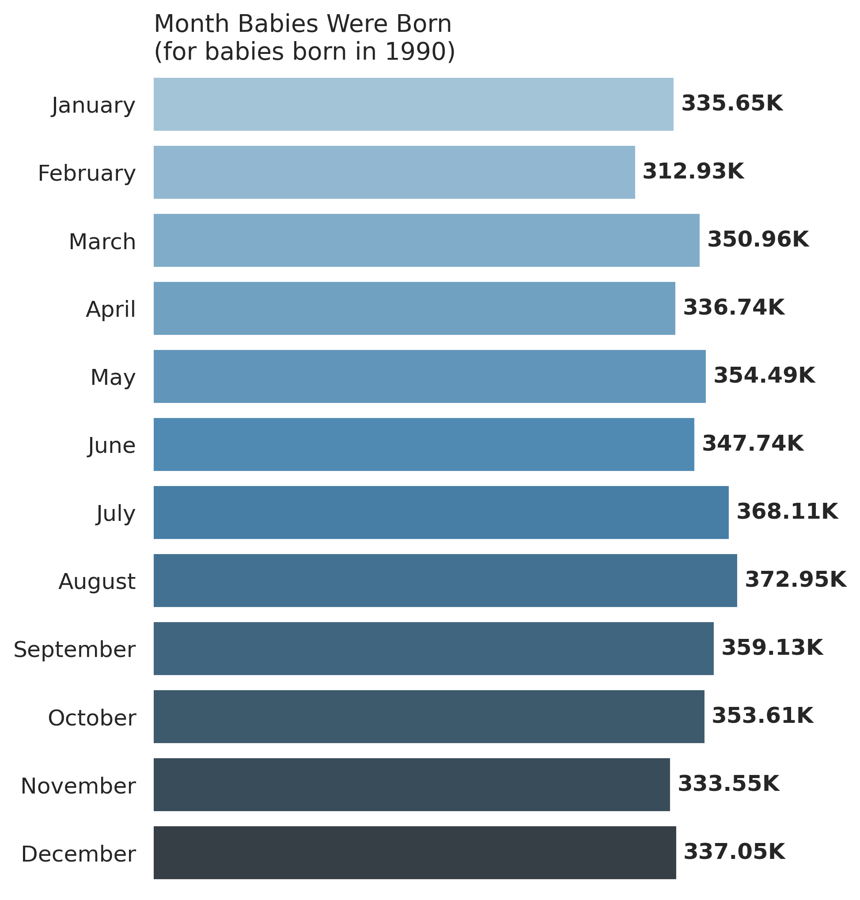

CDC Birth Data in Python
==============================

Exploring the CDC birth data files using Python.

The work can by broken into two parts:

1. Data prep and consolidation of all the records into several summary tables. The summary tables may be of use to others.

2. Analysis of the data, including production of several data visualizations

   

Note: **Still a work in progress!** I'll be updating as I go along. Here's a sample of the visualizations:

  
&nbsp; &nbsp; &nbsp; &nbsp;
  
&nbsp; &nbsp; &nbsp; &nbsp;

### Dataset
The data set is from the National Bureau of Economic Research (NBER), on their [Vital Statistics Natality Birth Data page](https://www.nber.org/research/data/vital-statistics-natality-birth-data). NBER has provided csv's of the birth data, by year, from 1968 to 2020. The data is originally sourced from the [CDC Vital Statistics](https://www.cdc.gov/nchs/data_access/vitalstatsonline.htm), and totals ~19 GB, uncompressed.

### Analysis Summary

#### Monthly Births
I'm interested in seeing which months of the year are most popular for births. Answer: the summer!

You can reproduce the charts below by running the `make figures` command. See the interactive chart of the violin plot on my [blog](https://www.tvhahn.com/posts/beautiful-plots-violin/), and run it in [Colab](https://colab.research.google.com/github/tvhahn/Beautiful-Plots/blob/master/Violin/violin_plot.ipynb). 

Figure showing the percentage change in births by month. Note that the summer months are the most popular for giving birth.
<figure>
       
</figure>

Plotting the numbers by year and month is less useful, like in the figure below, but still interesting.
<figure>
       
</figure>

I've also created choropleth maps of the birth data, by state, for the years 1981-2020. I just need to fix some things and put them up....

## Setup

Project will work well in a Linux and on a HPC environment. It will also work with MacOS (although not tested). Windows may require some minor changes by the user.

The following tables are currently generated:

* `births_simple.csv` - number of births, by year and month, from 1968 to 2020. Included in GitHub repo.

* `births_simple_with_apgar.csv` - number of births, by year and month, including the APGAR score, from 1968 to 2020. Also included in repo.
* `births_with_geo_apgar_consolidated.csv.gz` - number of births, with geography data and APGAR scores. Birth totals are grouped by geography, APGAR score, and date. Data is only from 1982 to 2004 (years where geo data is still publicly accessible). This file is included in repo (only 7 MB).
* `births_with_geo_apgar.csv.gz` - number of births, with geography data and APGAR scores, but not grouped by. Not included in this repo cause of size (~90 MB).

All the figures can be generated from the first three csv's listed above.

### Setup Steps

To reproduce results:

1. Clone this repo - `clone https://github.com/tvhahn/cdc-birth-data.git`
2. Create virtual environment. Assumes that Conda is installed.
   * Linux/MacOS: use command from the Makefile in the root directory - `make create_environment`
   * Windows: from root directory - `conda env create -f envcdcbirth.yml`
   * HPC: `make create_environment` will detect HPC environment and automatically create environment from `make_hpc_venv.sh`. Tested on Compute Canada. Modify `make_hpc_venv.sh` for your own HPC cluster.

...

## Project Organization

    ├── LICENSE
    ├── Makefile           <- Makefile with commands like `make data` or `make train`
    ├── README.md          <- The top-level README for developers using this project.
    ├── data
    │   ├── external       <- Data from third party sources. You'll find geocoding data here.
    │   ├── interim        <- Intermediate data that has been transformed.
    │   ├── processed      <- The final, canonical data sets for modeling.
    │   └── raw            <- The original, immutable data dump.
    │
    │
    ├── models             <- Models (don't have any at the moment)
    │
    ├── notebooks          <- Jupyter notebooks.
    │   └── scratch        <- Jupyter notebooks of questionable quality.
    
    │
    ├── references         <- Data dictionaries, manuals, and all other explanatory materials.
    │
    ├── reports            <- Generated analysis as HTML, PDF, LaTeX, etc.
    │   └── figures        <- Generated graphics and figures to be used in reporting
    │
    ├── requirements.txt   <- The requirements file for reproducing the analysis environment, e.g.
    │                         generated with `pip freeze > requirements.txt`
    │
    ├── setup.py           <- makes project pip installable (pip install -e .) so src can be imported
    ├── src                <- Source code for use in this project.
    │   ├── __init__.py    <- Makes src a Python module
    │   │
    │   ├── data           <- Scripts to download or generate data
    │   │
    │   ├── features       <- Not used at present
    │   │
    │   ├── models         <- Not used at present
    │   │
    │   └── visualization  <- Scripts to create exploratory and results oriented visualizations
    │       └── visualize.py
    │

## Future Work

Ideas to consider:

* Identify anomalies by geography (although geo data may not be fine enough)
* Allow user to select any number of columns, and spit out new consolidated data file <-- this is my number one priority.

Any other suggestions, let me know! Happy to hack away at this with others. Cheers!

