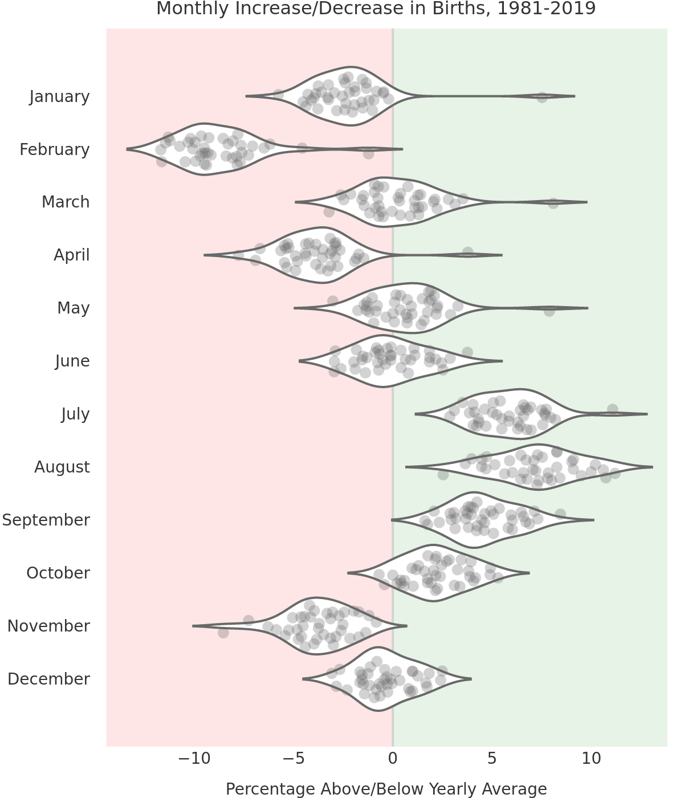

CDC Birth Data in Python
==============================

Exploring the CDC birth data files using Python.

The work can by broken into two parts:

1. Data prep and consolidation of all data files into several summary tables. The summary tables may be of use to others.
2. Analysis of the data, including production of several data visualizations

**Still a work in progress.**

<figure>
       
</figure>

### Dataset
The data set is from the National Bureau of Economic Research (NBER), on their [Vital Statistics Natality Birth Data page](https://www.nber.org/research/data/vital-statistics-natality-birth-data). NBER has provided csv's of the birth data, by year, from 1968 to 2020. The data is originally sourced from the [CDC](https://www.cdc.gov/nchs/data_access/vitalstatsonline.htm).

### Analysis Summary

## Setup

Project will work well in a Linux and on a HPC environment. It will also work with MacOS (although not tested). Windows may require some minor changes by the user.

Project Organization
------------

    ├── LICENSE
    ├── Makefile           <- Makefile with commands like `make data` or `make train`
    ├── README.md          <- The top-level README for developers using this project.
    ├── data
    │   ├── external       <- Data from third party sources.
    │   ├── interim        <- Intermediate data that has been transformed.
    │   ├── processed      <- The final, canonical data sets for modeling.
    │   └── raw            <- The original, immutable data dump.
    │
    ├── docs               <- A default Sphinx project; see sphinx-doc.org for details
    │
    ├── models             <- Trained and serialized models, model predictions, or model summaries
    │
    ├── notebooks          <- Jupyter notebooks. Naming convention is a number (for ordering),
    │                         the creator's initials, and a short `-` delimited description, e.g.
    │                         `1.0-jqp-initial-data-exploration`.
    │
    ├── references         <- Data dictionaries, manuals, and all other explanatory materials.
    │
    ├── reports            <- Generated analysis as HTML, PDF, LaTeX, etc.
    │   └── figures        <- Generated graphics and figures to be used in reporting
    │
    ├── requirements.txt   <- The requirements file for reproducing the analysis environment, e.g.
    │                         generated with `pip freeze > requirements.txt`
    │
    ├── setup.py           <- makes project pip installable (pip install -e .) so src can be imported
    ├── src                <- Source code for use in this project.
    │   ├── __init__.py    <- Makes src a Python module
    │   │
    │   ├── data           <- Scripts to download or generate data
    │   │   └── make_dataset.py
    │   │
    │   ├── features       <- Scripts to turn raw data into features for modeling
    │   │   └── build_features.py
    │   │
    │   ├── models         <- Scripts to train models and then use trained models to make
    │   │   │                 predictions
    │   │   ├── predict_model.py
    │   │   └── train_model.py
    │   │
    │   └── visualization  <- Scripts to create exploratory and results oriented visualizations
    │       └── visualize.py
    │
    └── tox.ini            <- tox file with settings for running tox; see tox.readthedocs.io

## Future Work

Ideas to consider:

* Identify anomalies by geography (although geo data may not be fine enough)

